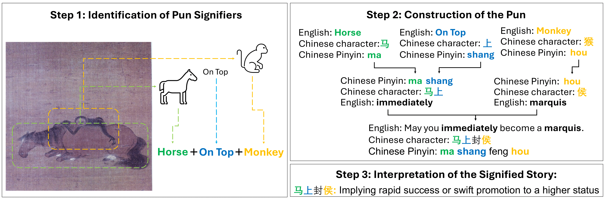

# Benchmark Code for Chinese Pun Rebus Art Dataset

## Table of Contents
* Overview
* Data Download
* Usage
* Contact

## Overview
This is the official implementation of 'Creating a Lens of Chinese Culture: A Multimodal Dataset for Chinese Pun Rebus Art Understanding.' In this repo, we provide the code to reproduce the results we listed in the paper. It is worth noting that the code here is only an example of how to leverage the Pun Rebus Dataset to evaluate the ability of LVMs. We encourage the readers to build or design more tailored evaluators based on the provided basic usages.

This repo contains:
* Download link for the artwork images inside the Pun Rebus Art Dataset.
* Ground Truth information for the Pun Rebus Art Dataset.
* Scorer for the three basic tasks.
* Baseline evaluation code with GPT-4, Gemini, Claude 3, and Qwen-VL model families.


<div align="center">
 
</div>


## Data Download
The dataset querying system is available at [this link](http://niyibin.org/punrebus/punrebus_main_en.php), where you can browse the whole dataset with both English and Chinese versions of the data annotations. To download the pure artwork images for the experiment, please use the following command:
```
bash download_images.sh
```
The answer sheet for evaluating LVM responses is available at [this link](https://github.com/zhang-tuo-pdf/Pun-Rebus-Art-Benchmark/blob/main/scorer/answer_sheet_w_element.csv). This csv file contains the category and key element information of each conveyed stories inside the dataset.

## Usage
In this file, we provide baseline evaluation code with GPT-4, Gemini, Claude 3, and Qwen-VL model families. For each model family, we provide three reader file for each basic tasks as we described in the paper. Take the readers for the GPT-4 model family as an example:
```
cd gpt4/reader
python read_image_element_gpt4v.py
```
Please remember to change your API keys before you run the evaluation code.

To evaluate the responses, please run the code inside the scorer folder. We provide three independent scorers for each task. Before you run it, please make sure to change the doc_file to your response text file path.
```
cd scorer
python mc_image_scorer.py
```

## Contact
We welcome researchers and enthusiasts interested in this program to join us in expanding and improving this valuable resource. Feel free to contact us if you are interested or have any questions during the usage!

Please cite our paper for the usage
```
@inproceedings{Zhang2024CreatingAL,
  title={Creating a Lens of Chinese Culture: A Multimodal Dataset for Chinese Pun Rebus Art Understanding},
  author={Tuo Zhang and Tiantian Feng and Yibin Ni and Mengqin Cao and Ruying Liu and Katharine Butler and Yanjun Weng and Mi Zhang and Shrikanth S. Narayanan and Salman Avestimehr},
  year={2024},
  url={https://api.semanticscholar.org/CorpusID:270560580}
}
```

Tuo Zhang tuozhang@usc.edu

Tiantian Feng tiantiaf@usc.edu


